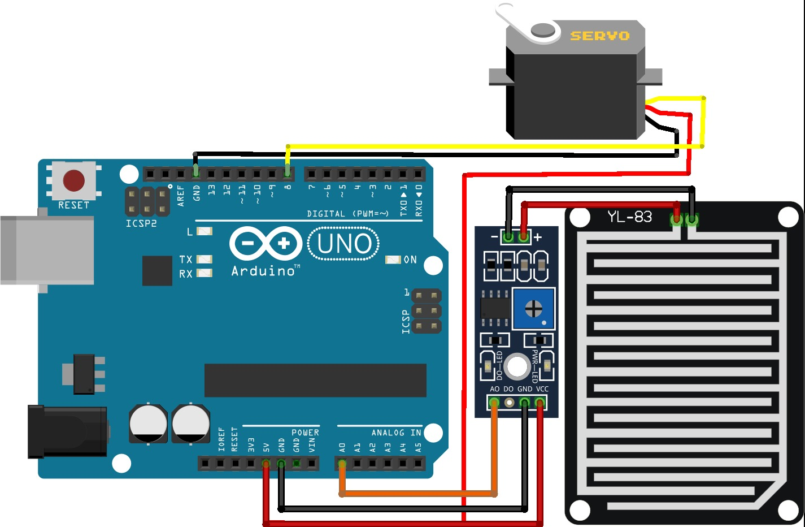

# 🌧️ Automatic Clothes Drying Stand

This project demonstrates an **Automatic Clothes Drying Stand System** using **Arduino UNO**, a **Raindrop Sensor**, and a **Servo Motor**.

When rain is detected, the system automatically moves the clothes stand to a safe position using a servo motor, helping to protect clothes from getting wet.

---

## 🧩 Components Required (Mandatory)

| Component | Quantity |
|---------|----------|
| Arduino UNO Board | 1 | 
| Servo Motor | 1 | 
| Raindrop Sensor | 1 | 
| Jumper Wires | As required |  
| Double Battery Holder | 1 | 
| DC Jack | 1 |
| Switch | 1 | 
| 3.7V Lithium-Ion Batteries | 2 | 

---

## 🖼️ Project Diagram

  

 

---

## 📚 Required Arduino Library (Important ⚠️)

- **Servo Library**

### ✅ How to Check if the Servo Library Is Installed
1. Open **Arduino IDE**
2. Go to **File → Examples**
3. Scroll down
4. If **Examples from Custom Libraries** is visible and **Servo** appears, the library is correctly installed

### 🔧 How to Install / Update the Library
1. Open **Arduino IDE**
2. Press **Ctrl + Shift + I** to open **Library Manager**
3. In the **Search Box**, type:  
4. Install the library if it is not installed
5. If already installed, check for **updates** and update if available
6. If errors appear after installation:
- Close Arduino IDE
- Reopen Arduino IDE and try again

---

## 🔋 Power System Connection

1. The **Double Battery Holder** contains:
- **Red Wire** → Positive (+)
- **Black Wire** → Negative (−)
2. Make the connections as follows:
- Battery Holder **Red Wire** → **One pin of the Switch**
- **Other pin of the Switch** → **Positive (+) pin of the DC Jack**
- Battery Holder **Black Wire** → **Negative (−) pin of the DC Jack**

This setup allows safe power control using the switch.

---

## 🔌 Circuit Connections

### 🌧️ Raindrop Sensor to Arduino UNO

1. First, place the **Raindrop Sensor** properly
2. Make the following connections:

| Raindrop Sensor Pin | Arduino UNO Pin |
|-------------------|----------------|
| SDA | Power Pin 5V |
| GND | Power Pin GND |
| AO  | Analog Pin A0 |

---

### ⚙️ Servo Motor to Arduino UNO

| Servo Wire Color | Arduino UNO Pin |
|-----------------|-----------------|
| Orange (Signal) | Digital Pin 7 |
| Red (VCC)       | Power Pin  5V |
| Brown (GND)     | Power Pin GND |

---

## ⚙️ Working Principle

1. The system continuously monitors the **Raindrop Sensor**
2. When **rain is detected**:
- The sensor sends an analog signal to Arduino
- Arduino rotates the **Servo Motor**
- Clothes drying stand moves automatically to a protected position
3. When **no rain is detected**:
- The servo returns to its normal position

---

## 🏠 Applications

- Smart Home Automation
- Automatic Clothes Protection System
- Arduino & IoT Learning Projects
- Rain Detection Systems