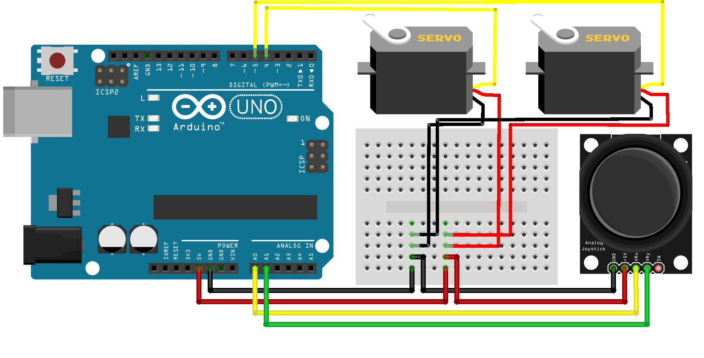

# 🎮 Joystick Controlled Maze Game

Traditional maze games rely on **manual tilting**, which limits precision and interactivity.  
This **Arduino-based maze game** uses a **joystick and servo motors** to precisely control the platform movement, providing smoother control, improved accuracy, and enhanced hand-eye coordination 🧠✨.

This project is ideal for **Arduino beginners**, **STEM projects**, and **interactive game design learning**.

---

## 🛠️ Components Required

| Component | Quantity |
|---------|----------|
| Arduino UNO Board | 1 |
| X-Y Axis Joystick | 1 |
| Servo Motor | 2 |
| Jumper Wires | As required |
| Double Battery Holder | 1 |
| DC Jack | 1 |
| Switch | 1 |
| 3.7V Lithium-Ion Battery | 2 |

----

## 🖼️ Project Diagram

  

 

---

## 📚 Required Arduino Libraries (IMPORTANT)

⚠️ **Before uploading the code, the following libraries must be installed:**

- **Servo Motor Library**
- **Joystick Library**

---

## 🔧 How to Install Libraries

1. Open **Arduino IDE**
2. Press **Ctrl + Shift + I** to open **Library Manager**
3. In the **Search box**, type:
   - `Servo`
   - `Joystick`
4. Click **Install** if not installed
5. If already installed, check for **updates** and update if available 🔄

---

## ✅ Verify Library Installation

- Go to:  
  **File → Examples**
- Scroll down and check for:  
  **Examples from Custom Libraries**

If the libraries appear there, they are **installed correctly** ✔️

❗ If errors still appear after installation:
- Close Arduino IDE
- Reopen Arduino IDE
- Try again

---

## 🔋 Power System Connection

Follow these steps carefully to avoid damage ⚡

1. The **Double Battery Holder** has:
   - **Red wire** → Positive (+)
   - **Black wire** → Negative (–)

2. Connect the **Red wire from the battery holder** to **one pin of the switch**

3. Connect the **other pin of the switch** to the **Positive (+) wire of the DC Jack**

4. Connect the **Black wire from the battery holder** directly to the **Negative (–) terminal of the DC Jack**

5. Then connect the DC Jack to the Arduino DC input.

---

## 🎯 Features

- 🎮 Smooth joystick-controlled platform movement
- ⚙️ Precise servo motor control
- 🧠 Improves hand-eye coordination
- 🔋 Portable battery-powered system
- 🛠️ Beginner-friendly Arduino project

---

## 📌 Notes

- Ensure batteries are **fully charged**
- Double-check wiring before powering ON 🔍
- Use a stable platform for accurate servo movement

---

## 🤝 Contributions

Feel free to **fork**, **improve**, and **submit pull requests**.  
Suggestions and improvements are always welcome 😊