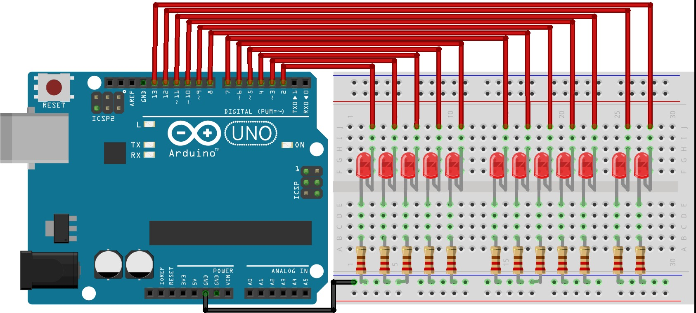

# 🔦 Dynamic LED Chaser Projects using Arduino UNO

## 📌 Project Overview

This repository contains **three Arduino LED Chaser programs** designed to demonstrate different LED animation patterns using an **Arduino UNO**.

Dynamic lighting effects are commonly used in electronics projects, but they often require complex circuitry and programming. These projects simplify the learning process by using basic Arduino logic to control multiple LEDs in sequential and patterned animations.

These projects are part of a **12-in-1 Electronics Learning Kit** and are ideal for beginners and students.

---

## 🧰 Components Required

- 1 x Arduino UNO Board  
- 12 x LEDs  
- 12 x 220 Ohm Resistors  
- 1 x Breadboard  
- Jumper Wires  
- 1 x Double Battery Holder with DC Jack & Switch  
- 2 x 3.7 V Rechargeable Batteries  

---

## 📁 Project Files

The table below describes the Arduino source files included in this repository:

| File Name | Description |
|----------|-------------|
| [`35.1.ino`](./35.1.ino) | Basic LED chaser program where LEDs turn ON and OFF sequentially from first to last. Ideal for understanding digital output basics. |
| [`35.2.ino`](./35.2.ino) | Improved LED chaser with reverse or bidirectional movement, helping learners understand loops and timing logic. |
| [`35.3.ino`](./35.3.ino) | Advanced LED pattern demonstrating smoother transitions and enhanced animation effects using delays and structured logic. |

---

## 🔌 Circuit Description

- Each LED is connected to an Arduino digital pin via a 220Ω resistor.
- All LED cathodes are connected to the Arduino GND.
- The Arduino controls each LED individually to create chasing and animation effects.
- Power can be supplied using USB or the battery holder with switch.

  

 

---

## 💻 Software Details

- Platform: Arduino  
- Board: Arduino UNO   

Main functions used:
- `pinMode()`
- `digitalWrite()`
- `delay()`
- `for` loops

---

## 🚀 How to Use

1. Assemble the circuit on a breadboard
2. Connect the Arduino to your computer
3. Open Arduino IDE
4. Select **Board: Arduino UNO**
5. Select the correct **COM Port**
6. Open any `.ino` file from this repository
7. Upload the code and observe the LED effects

---

## 📷 Applications

- Arduino learning projects  
- LED animation practice  
- Educational electronics kits  
- Decorative and display lighting  

---

## 🛠️ Future Improvements

- Speed control using a potentiometer  
- Button-controlled animation modes  
- RGB LED effects  
- Sound-reactive LED patterns  
