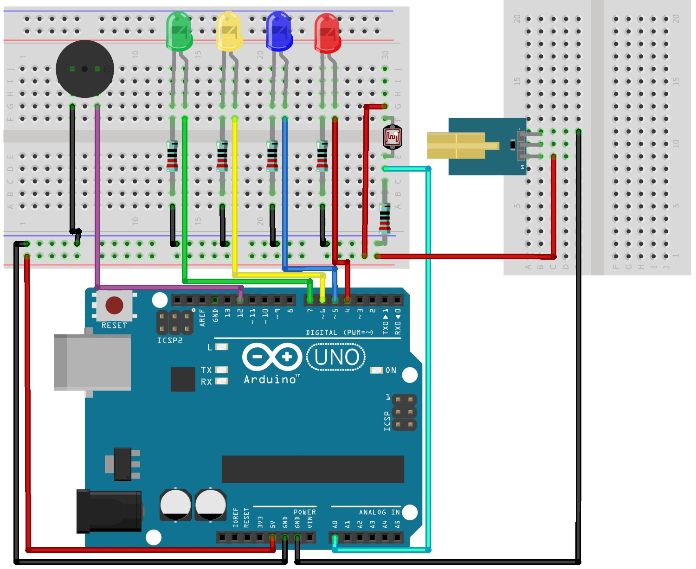

# 🔦 Arduino Laser Security System

This project is a **simple Arduino-based Laser Security System** using a **Laser Emitter**, **LDR sensor**, and **LED indicators**.  
When the laser beam is interrupted, the system detects the change in light intensity and triggers LEDs as an alert 🚨.

This project is ideal for **beginners**, **school projects**, and **basic electronics learning** using Arduino 😊.

---

## 📦 Components Required

| Component Name                                   | Quantity |
|------------------------------------------------|----------|
| Arduino UNO Board                               | 1        |
| Laser Emitter                                  | 1        |
| LDR (Light Dependent Resistor) Sensor           | 1        |
| LEDs                                           | 4        |
| 220 Ohm Resistors                               | 5        |
| Small Breadboard                               | 1        |
| Mini Breadboard                                | 1        |
| Jumper Wires                                   | As needed |
| Double Battery Holder                          | 1        |
| DC Jac                                         | 1        |
| Switch                                         | 1        |
| 3.7V Lithium ion Batteries                    | 2        |

---

## 🖼️ Project Diagram

  

 

---

## ⚙️ Project Description

🔹 The **Laser Emitter** continuously points a laser beam at the **LDR sensor**.  
🔹 As long as the laser beam reaches the LDR, the system remains in a normal state.  
🔹 When the beam is blocked, the Arduino detects the change and activates the **LEDs** as an alert indication 💡.  

This setup demonstrates:
- Light sensing using LDR 🌤️
- Digital output control with LEDs
- External battery-powered Arduino operation 🔋

---

## 🔌 Power System Connection (Important)

⚠️ Follow these steps carefully to power the Arduino safely:

1. The **Double Battery Holder** has two wires:
   - 🔴 **Red Wire** → Positive (+)
   - ⚫ **Black Wire** → Negative (–)

2. Connect the **Black wire (Negative)** directly to the **Negative terminal of the DC Jack**.

3. Connect the **Red wire (Positive)** as follows:
   - Connect the **Red wire** from the battery holder to **one pin of the Switch**
   - Connect the **other pin of the Switch** to the **Positive terminal of the DC Jack**

4. Insert the **DC Jack** into the **DC input port of the Arduino UNO**.

🔋 This allows the Arduino to be powered ON/OFF safely using the switch.

---

## 🧠 How It Works

✨ Laser light falls on the LDR  
✨ Arduino reads LDR value  
✨ If light is interrupted → LEDs turn ON  
✨ If light is normal → LEDs remain OFF  

Simple, effective, and educational 🚀

---

## ✅ Applications

- Home security demo 🏠
- Door intrusion alert 🚪
- School & college Arduino projects 🎓
- Basic sensor learning projects 🤖

---

## ❤️ Final Notes

This project is **low-cost**, **easy to build**, and **perfect for learning Arduino basics**.  
Feel free to improve it by adding:
- Buzzers 🔊
- LCD displays 📟
- IoT notifications 🌐