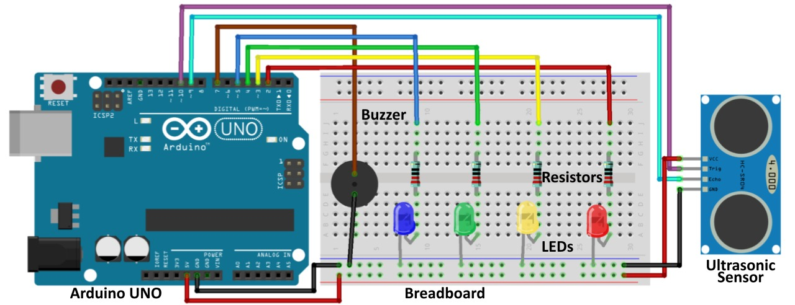

# 🚗 Smart Car Reversing Parking Assister

Reversing a car in tight spaces can be challenging and risky due to limited visibility.  
This project uses an **ultrasonic sensor** to detect nearby obstacles and provides **real-time alerts** using **LEDs and a buzzer**, helping the driver park more safely and confidently.

The system measures the distance between the vehicle and obstacles behind it.  
As the distance decreases, LEDs turn on progressively and the buzzer alerts the user, reducing the risk of collisions. ⚠️🔊

---

## 🔧 Components Required

| Component | Quantity |
|---------|----------|
| Arduino UNO Board | 1  
| Ultrasonic Sensor (HC-SR04) | 1  
| LEDs | 4  
| Resistors | 4  
| Buzzer | 1  
| Jumper Wires  
| Double Battery Holder | 1  
| DC Jack | 1  
| Switch | 1  
| 3.7V Rechargeable Batteries | 2  

---

## 🖼️ Project Diagram

  

 

---

## ⚙️ System Description

- The **ultrasonic sensor** continuously measures the distance to obstacles.
- **LED indicators** show distance levels (far to near).
- A **buzzer** provides an audible warning when an obstacle is too close.
- The system is powered using **two 3.7V rechargeable batteries**.
- A **switch** is used to safely turn the system ON or OFF.

This setup is ideal for **reverse parking assistance**, **robotics**, or **DIY vehicle safety projects**. 🤖🚘

---

## 🔋 Power System Wiring (Important)

The **Double Battery Holder** contains two wires:
- **Red wire** → Positive (+)
- **Black wire** → Negative (–)

### 🔌 Connection Method:

1. Connect the **black (negative) wire** from the Double Battery Holder **directly to the negative terminal of the DC Jack**.
2. Connect the **red (positive) wire** from the Double Battery Holder to **one pin of the Switch**.
3. Connect the **other pin of the Switch** to the **positive terminal of the DC Jack**.

⚠️ This ensures proper power control and protects the circuit when switching ON or OFF.

---

## 🧠 Working Principle

- When an object is detected within a specific range:
  - LEDs light up based on distance.
  - The buzzer activates as the object gets closer.
- This provides both **visual** and **audio feedback** for safer reversing.

---

## ✅ Features

- Real-time obstacle detection
- Simple and low-cost components
- Portable battery-powered design
- Easy to expand or modify
- Ideal for beginners and students 🎓

---

## 📌 Applications

- Reverse parking assistance systems
- Robotics obstacle detection
- Arduino learning projects
- DIY vehicle safety systems